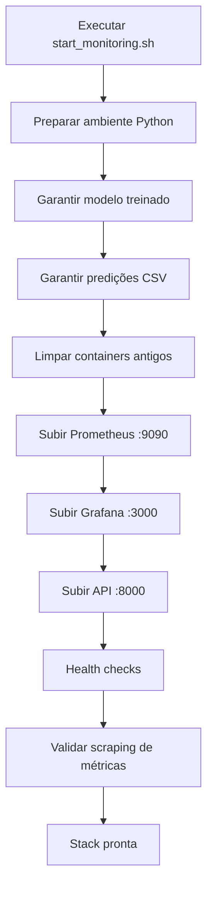

# 🚀 Fluxo Executivo e Didático: start_monitoring.sh

Este guia explica, de forma executiva e prática, o que acontece ao executar:

```bash
./scripts/start_monitoring.sh
```

## 🎯 Resumo Executivo

Com um único comando, o projeto prepara dados e modelo, sobe API + Prometheus + Grafana, valida saúde dos serviços e confirma que as métricas estão sendo coletadas.

**Resultados esperados ao final:**
- API de predição disponível
- Prometheus coletando métricas da API
- Grafana com dashboards prontos para uso

## 🧭 Por que este fluxo importa

- Reduz setup manual e risco de erro operacional
- Padroniza ambiente para aulas, demonstrações e validações
- Acelera onboarding: do zero até dashboards em poucos minutos
- Garante validação mínima de saúde antes do uso

## 🏗️ Visão da Arquitetura do Fluxo



## 📦 Etapas do Script (1 a 7)

### 1) Preparação do ambiente e ativos de ML

O script:
- Detecta `python3` (ou usa `python` como fallback)
- Verifica dependências Python e instala se necessário
- Treina modelo caso não exista arquivo em `models/`
- Gera predições caso não exista `outputs/predicoes.csv`

**Objetivo:** garantir que a API tenha artefatos necessários para iniciar com dados válidos.

### 2) Limpeza de containers antigos

Remove containers existentes com os nomes:
- `prometheus`
- `grafana`
- `api-churn`

**Objetivo:** evitar conflito de nome/estado entre execuções.

### 3) Inicialização do Prometheus

- Faz build da imagem a partir do Dockerfile específico
- Sobe container na porta `9090`
- Carrega configuração de scraping e regras de alerta

**Objetivo:** iniciar coleta e avaliação de métricas/alertas.

### 4) Inicialização do Grafana

- Faz build da imagem com provisioning
- Sobe container na porta `3000`
- Provisiona datasource Prometheus e dashboards automaticamente

**Objetivo:** disponibilizar visualização imediata sem setup manual.

### 5) Inicialização da API de Churn

- Faz build da API
- Sobe container na porta `8000`
- API expõe endpoints funcionais e `/metrics`

**Objetivo:** disponibilizar serviço de predição com instrumentação Prometheus.

### 6) Validação de saúde

Após aguardar inicialização, o script testa:
- Prometheus: `/-/healthy`
- Grafana: `/api/health`
- API: `/health`

**Objetivo:** confirmar que os serviços principais estão respondendo.

### 7) Verificação de coleta de métricas

O script consulta os targets do Prometheus e verifica se há target `up`.

**Objetivo:** confirmar integração real entre Prometheus e API, além de apenas "container de pé".

## ⏱️ Tempo Estimado

| Cenário | Tempo típico |
|---------|--------------|
| Primeira execução | 4 a 7 minutos |
| Execuções seguintes | 1 a 2 minutos |

A primeira execução é mais lenta por instalar dependências e gerar artefatos iniciais.

## 🌐 URLs e acessos ao final

| Serviço | URL | Credenciais |
|---------|-----|-------------|
| API | http://localhost:8000 | - |
| API Docs | http://localhost:8000/docs | - |
| Métricas API | http://localhost:8000/metrics | - |
| Prometheus | http://localhost:9090 | - |
| Grafana | http://localhost:3000 | admin / admin |

## ✅ Validação rápida pós-start

```bash
# API
curl http://localhost:8000/health

# Métricas da API
curl http://localhost:8000/metrics

# Prometheus saudável
curl http://localhost:9090/-/healthy
```

## 🧪 Gerar tráfego para popular dashboards

```bash
python scripts/test_api_load.py
```

Esse comando dispara requisições na API e acelera o aparecimento de dados nos painéis.

## 🛑 Como parar a stack

```bash
./scripts/stop_monitoring.sh
```

Para limpeza completa, consulte opções adicionais no script de parada.

## 🧯 Troubleshooting rápido

### Porta em uso (3000, 8000, 9090)

```bash
docker ps
./scripts/stop_monitoring.sh
```

### API não sobe

Verifique se `outputs/predicoes.csv` existe e consulte logs:

```bash
docker logs -f api-churn
```

### Prometheus não coleta métricas

- Confirme se API responde em `http://localhost:8000/metrics`
- Confira status de targets no Prometheus
- Consulte logs:

```bash
docker logs -f prometheus
```

### Grafana sem dashboards

```bash
docker logs -f grafana
```

Aguarde alguns segundos após o start para conclusão do provisioning.

## 🔎 Referências técnicas

- Script principal: `scripts/start_monitoring.sh`
- Config Prometheus: `monitoring/prometheus/prometheus.yml`
- Regras de alerta: `monitoring/prometheus/alert_rules.yml`
- Datasource Grafana: `monitoring/grafana/provisioning/datasources/prometheus.yml`
- Provisioning de dashboards: `monitoring/grafana/provisioning/dashboards/dashboards.yml`
- Dockerfile da API: `Dockerfile.api`

## 📌 Próximos passos sugeridos

1. Executar o start e validar health checks.
2. Rodar teste de carga para popular métricas.
3. Navegar pelos dashboards: API Health, ML Metrics, Business Churn, Overview.
4. Revisar alertas ativos no Prometheus.
